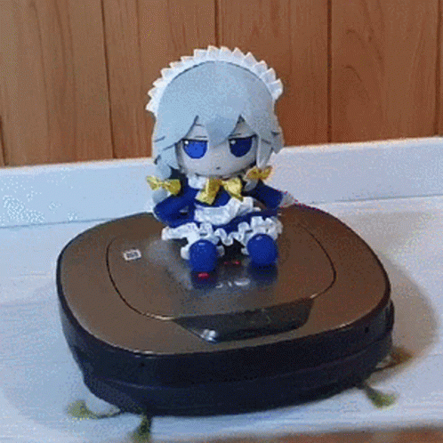

<samp>

<h2 align="center">Hello! My name is <a href="https://jiansu.dev">Qiang Cai</a> 👋</h3>

<ul>
    <li>I am a BSc Computer Science student @ <a href="https://cs.nott.ac.uk">University of Nottingham</a></li>
    <li>My main interests are generally in backend development; stuff such as operating systems, computer graphics, and cyber security.</li>
    <li>I also like and do art.
</ul>

 

<h3 align="center">Check out my <a href="https://jiansu.dev">portfolio website!</a></h3>

</samp>